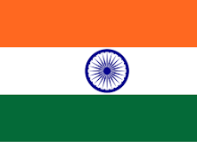

# India Tour of Australia
### India Squad:

Rohit Sharma (C), Jasprit Bumrah (VC), Ravindra Jadeja, Yashasvi Jaiswal, Dhruv Jurel (Wk), Sarfaraz Khan, Virat Kohli, Prasidh Krishna, Ravichandran Ashwin, Mohammad Shami, Rishabh Pant (Wk), KL Rahul, Harshit Rana, Abhimanyu Easwaran, Shubman Gill, Nitish Kumar Reddy, Mohammed Siraj, Washington Sundar
### Australia Squad:

Pat Cummins (C), Scott Boland, Alex Carey (Wk), Josh Hazlewood, Travis Head, Josh Inglis (Wk), Usman Khawaja, Marnus Labuschagne, Nathan Lyon, Mitch Marsh, Nathan McSweeney, Steve Smith, Mitchell Starc
### Matches:
1. Nov 22, Fri - Nov 26, Tue	1st Test	07:50:00	Perth Stadium, Perth
2. Dec 06, Fri - Dec 10, Tue	2nd Test	09:30:00	Adelaide Oval, Adelaide
3. Dec 14, Sat - Dec 18, Wed	3rd Test	05:50:00	The Gabba, Brisbane
4. Dec 26, Thu - Dec 30, Mon	4th Test	05:00:00	Melbourne Cricket Ground, Melbourne
5. Jan 03, Fri - Jan 07, Tue	5th Test	05:00:00	Sydney Cricket Ground, Sydney

For More Information [Click Here](https://www.espncricinfo.com/series/australia-vs-india-2024-25-1426547)

